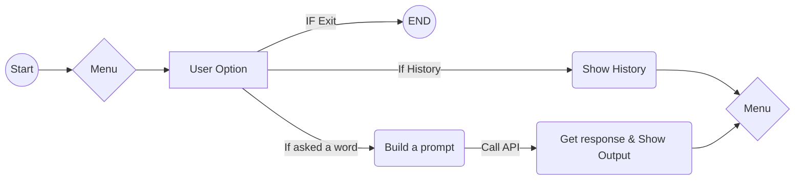

# AI Word Dictionary
A simple **console-based Python project** that helps you explore words using **AI-powered definitions, examples, synonyms, and antonyms**.  

## Features
-   [x] Get **definitions** in simple sentences
-   [x] Generate **example sentences**
-   [x] Discover **synonyms & antonyms**
-   [x] **All-in-One mode** for quick word exploration
-   [x] Keeps a **history of searched words**

## Run
> pip install openai
- Add your API KEY (API_KEY = "your_api_key_here")
> python main.py

## Why It’s Awesome

-   Lightweight (single `main.py` file)
-   Beginner-friendly, yet **AI-powered**
-   Works with **OpenAI**
-   Great for learning **Python + APIs**
-   Expandable into bigger NLP projects

## Code Flow

## Thumbnail
- Image in Root directory.

## Closing Notes

This project is a **beginner-friendly yet powerful example** of how AI can be integrated into simple Python programs.  
It shows how API like **OpenAI** can turn a console app into an **AI-powered word explorer**.  

- Great starting point for **Natural Language Processing (NLP)** projects.
- Can be extended into a **chatbot, dictionary app, or language learning tool**.
- Open for contributions and ideas from the community.

If you like this project, don’t forget to **star  the repo** and share it with your friends.  

Let’s keep exploring words — with the power of AI! 
---